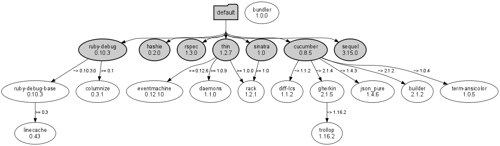

!SLIDE center
# Command Line Interface
# CLI

!SLIDE small bullets incremental
# Primary commands

* $ bundle install
* $ bundle update
* $ bundle package
* $ bundle exec
* $ bundle config

!SLIDE small bullets incremental
# Utilities

* $ bundle check
* $ bundle list
* $ bundle show
* $ bundle console

!SLIDE small bullets incremental
# Utilities

* $ bundle open
* $ bundle viz
* $ bundle init
* $ bundle gem

!SLIDE center
# Primary commands

!SLIDE code commandline incremental
## install
	$ bundle install
	Install the gems specified by the Gemfile or Gemfile.lock

	$ bundle install --without production
	bundler will remember 

	$ bundle install --deployment
	Used for deploys - installs to vendor/bundle

!SLIDE bullets incremental 
## The Resolution on this thing is amazing...

* Installer < Environment
* Installer#run
* Installer calls self#specs
* Environment proxies to @definition#specs
* Definiton#specs causes a resolution

!SLIDE 
<h1>
  <a target="_blank" href="http://thebundler.heroku.com/image/cli/install.gif">
    Show Me
  </a>
</h1>
## (thanks perftools.rb)

!SLIDE code commandline incremental
## update
	$ bundle update
	Update dependencies to their latest versions

	$ bundle update gemname
	Update gemname to its latest version

!SLIDE code commandline incremental
## package
	$ bundle package
	Package the .gem files required by  your  application  into  the
	vendor/cache directory (so you can install without downloading)

!SLIDE code commandline incremental
## exec
	$ bundle exec
	Execute a script in the context of the current bundle

	$ bundle exec rspec

	$ bundle exec cucumber

!SLIDE code commandline incremental
## config
	$ bundle config
	Specify and read configuration options for bundler

	$ bundle config build.mysql --with-mysql-config=/usr/../bin/mysql_config

	$ bundle config gemfile DasGemFile

	$ bundle config thing setting
	$ bundle config thing Settings for `thing` in order of priority. The top value will be used
	  Set for the current user (/home/chris/.bundle/config): "setting"

	$ cat /home/chris/.bundle/config
	--- 
	BUNDLE_THING: setting

!SLIDE center
# Utilities

!SLIDE code small 
# check
	$ bundle check
	Determine  whether  the requirements  for  
	your application are
	installed and available to bundler

!SLIDE code small
# list
	$ bundle list
	Show all of the gems in the current bundle

!SLIDE code small 
# show
	$ bundle show
	Show the source location of a particular gem 
	in the bundle

	$ bundle show rails
	/usr/lib/ruby/gems/1.8/gems/rails-3.0.0

	$ bundle show bundler

!SLIDE code small
# open
	$ bundle open
	Open an installed gem in the editor

	$ vim $(bundle show)

!SLIDE code small
# console
	$ bundle console
	Start an IRB session in the context of the 
	current bundle

!SLIDE code small
# viz
## requires ruby-graphiz gem 

	$ bundle viz
	Generate a visual representation of your 
	dependencies

!SLIDE full-page center
# viz

!SLIDE code small
# init
	$ bundle init
	Generate a simple Gemfile, placed in 
	the current directory

!SLIDE code small 
# gem
	$ bundle gem test_gem
	Create a simple gem, suitable for 
	development with bundler

	$ ls
	Gemfile  lib  Rakefile  test_gem.gemspec

	$ ls lib/
	test_gem  test_gem.rb

