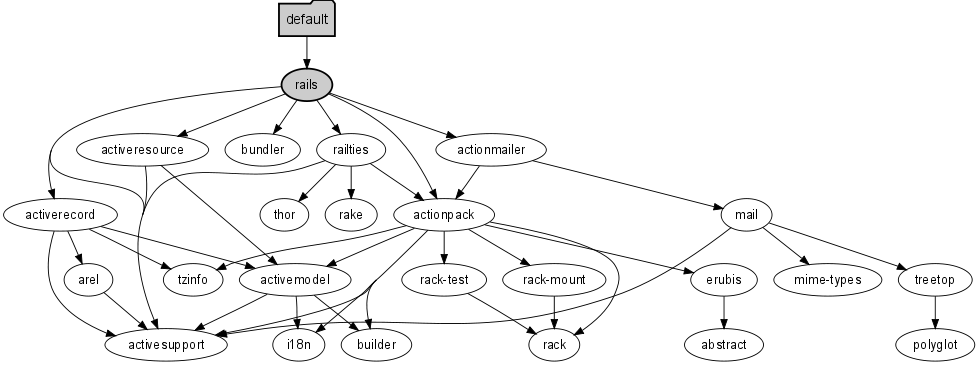

!SLIDE bullets incremental 
# The Easy
* Gemfile
* Gemfile.lock
* CLI

!SLIDE bullets incremental 
# Gemfile
* uses a DSL for specifying project gem dependencies
* evaluated as Ruby code

!SLIDE bullets incremental 
# Sources 
	@@@ruby
	source "http://rubygems.org"
	source "http://gemcutter.org"
	source "file://path_to_gems"

* At the top of the Gemfile
* one declaration per source

!SLIDE 
# Gems - Simple
	@@@ruby
	gem "rails"

!SLIDE bullets incremental
# Version Operators 
	@@@ruby
	gem "rails", ">= 3.0.0"
	gem "rails", "~> 3.0.0"

* "~>" Operator constrains version
* "~> 2.1.0" becomes ">= 2.1.0 < 2.2" 
* "~> 2.1" becomes ">= 2.1 < 3" 

!SLIDE 
# Require as
	@@@ruby
	gem "rails", "~> 3.0.0", 
		:require => "phails"

!SLIDE 
# Groups
	@@@ruby
	gem "ruby-debug", 
	  :group => [:development, :test]

!SLIDE 
# Groups - Block format
	@@@ruby
	group :test do
		gem "ruby-debug"
	end

!SLIDE 
# in ur codez
	@@@ruby
	Bundler.setup
	require 'bundler/setup'
	Bundler.setup
	Bundler.setup(:test, :default)
	
	Bundler.require
	Bundler.require(:test)
	Bundler.require(:test, :default)

!SLIDE smaller 
# in teh railz 3
## (config/boot.rb)
	@@@ruby
	gemfile = File.expand_path('../../Gemfile', __FILE__)
	begin
	  ENV['BUNDLE_GEMFILE'] = gemfile
	  require 'bundler'
	  Bundler.setup
	rescue Bundler::GemNotFound => e
	  STDERR.puts e.message
	  STDERR.puts "Try running `bundle install`."
	  exit!
	end if File.exist?(gemfile)

## config/application.rb
	@@@ruby
	 Bundler.require(:default, Rails.env) if defined?(Bundler)

!SLIDE 
# Platforms
	@@@ruby
	gem "ruby-debug", 
	  :platforms => [:mri_18, :jruby]

!SLIDE 
# Git
	@@@ruby
	gem "rails", 
	  :git => "git://github.com/rails/rails.git"

!SLIDE bullets incremental 
# Git
	@@@ruby
	gem "rails", "2.3.8",
	  :git => "git://github.com/rails/rails.git"

* Uses the .gemspec (as intended)
* Cannot have dependencies outside itself
* Uses gem build to build the gem
* spot the error

!SLIDE bullets incremental 
# Path
	@@@ruby
	gem "rails", 
	  :path => "vendor/rails"

* does not compile native extensions

!SLIDE bullets incremental
# We've just scratched the surface

!SLIDE bullets incremental
# Gemfile.lock

* Gemfile's evil twin responsible for ruining your day.

!SLIDE bullets incremental
# Gemfile.lock

* A snapshot of the gem versions in current use, resolved from the Gemfile.

!SLIDE code
<pre>
  GEM
    remote: http://rubygems.org/
    specs:
      Platform (0.4.0)
      actionmailer (2.3.9)
        actionpack (= 2.3.9)
      actionpack (2.3.9)
        activesupport (= 2.3.9)
        rack (~> 1.1.0)
      activemerchant (1.5.1)
  ...

  PLATFORMS
    ruby

  DEPENDENCIES
    activemerchant (= 1.5.1)
    acts_as_list (= 0.1.2)
    bluecloth (= 2.0.7)
    builder (= 2.1.2)
  ...
</pre>

!SLIDE bullets incremental
# Gemfile.lock
## What is it really?

* SOURCES
* GEM
* PLATFORMS
* DEPENDENCIES
* (more information)

!SLIDE bullets incremental
# NOT Yaml

* <code>Bundler::LockFileParser</code>
* parse_source
* parse_spec
* parse_platform
* parse_dependency

!SLIDE bullets incremental
# Gemfile

* holds the DRY input
* gem "rails"

!SLIDE bullets incremental
# Gemfile.lock

* makes your application a single package of both your own code and the third-party code it ran the last time you know for sure that everything worked. 
* rails -> actionmailer -> actionpack -> active_support && rack   

!SLIDE bullets incremental
# Other approaches

* keeping the gems with the code
* BUT - what about native extensions?
* BUT - what about the future?

!SLIDE bullets incremental
# Other approaches

* keeping a list of gems
* gems.each{ |g| `gem install #{g}` }
* BUT - what about version changes?
* BUT - what about dependencies?
* BUT - what about the future?

!SLIDE transition=fade bullets incremental

