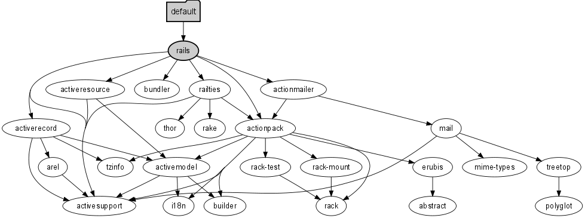

!SLIDE center 

!SLIDE bullets incremental transition=fade
* The easy
* The hard
* And the NP-complete

!SLIDE center
# ||

!SLIDE center
# Don't shoot the messenger

!SLIDE bullets incremental 
# Who am I?
* Chris Continanza, csquared,  @em_csquared
* Jack of all trades
* Master of One (Computer Science)
* I like to make stuff
* It's a Jersey thing 

!SLIDE 
# Back to...

!SLIDE center 

!SLIDE center 

!SLIDE transition=fade 
# The easy 
## Installz your gemz

!SLIDE commandline incremental 
	$ bundle 
	Fetching source index for http://rubygems.org/
	Using rake (0.8.7) 
	Using abstract (1.0.0)
	...
	Using railties (3.0.0)
	Using rails (3.0.0) 
	Your bundle is complete! Use `bundle show [gemname]` ...

!SLIDE transition=fade 
# The hard(er) 
## Use bundle gems instead of system gems

!SLIDE code 
# Fight the system (gems)

	@@@ruby
	require 'rubygems'
	require 'bundler'
	Bundler.setup
	Bundler.require

!SLIDE transition=fade 
# The NP-Complete #
## Constraint Satisfaction 

!SLIDE transition=fade bullets incremental

!SLIDE center 
## Haters gonna hate

