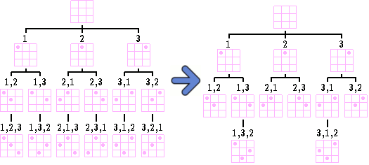
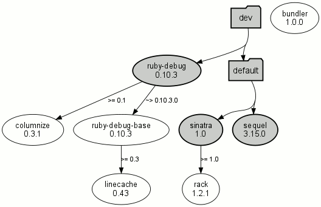
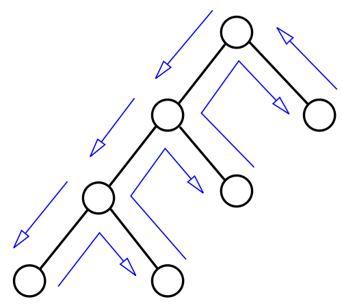
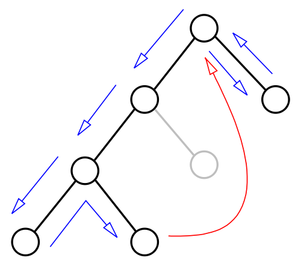

!SLIDE - bullets incremental
# The NP-Complete

* Constraint satisfaction

!SLIDE - bullets incremental
## What is Constraint satisfaction?

* 'finding a solution to a set of constraints' 
* by constraints, I mean yur Gemfile dood
* by solution, I mean that Gemfile.lock

!SLIDE 
# Wut?

!SLIDE 
# Forget Gems for a minute

!SLIDE
# Let's talk about Queens

!SLIDE center

!SLIDE
# No, the "N-Queens problem"

!SLIDE 
# Wut?

!SLIDE
# The "N-Queens Problem"

	@@@ruby
	def n_queens(N)                                   
	  # given an N X N chessboard                     
	  # place N queens on that chessboard                
	  #  *so that none of them 
	  #   can attack each other!   
	end                                               

!SLIDE code center 
# Example N = 4
<pre style="font-size:5em">
    0 1 2 3
  0 . Q . .
  1 . . . Q
  2 Q . . .
  3 . . Q .
</pre>

!SLIDE 
# What to do?

!SLIDE 
# Easy - Brute Force that shit!

!SLIDE bullets incremental
# Brute force

* generate a solution
* check that it is a solution
* if not, repeat

!SLIDE 
# But before we do...

!SLIDE center 
# Define 'solution'
## (Clever Girl) 

<pre>
===== Solution for N=10 ======

[0, 2, 5, 7, 9, 4, 8, 1, 3, 6]
</pre>

## index, value = row, column

!SLIDE 
# Show Me
## <a href='http://github.com/csquared/NQueens' target="_blank"> TO THE GITHUB!</a>
## (and the command line)

!SLIDE commandline incremental 
# Time is not on your side

	$time ruby exhaustive.rb 15
	^Cexhaustive.rb:21:in `solve': Interrupt
	        from exhaustive.rb:20:in `permutation'
	        from exhaustive.rb:20:in `solve'
	        from exhaustive.rb:29
	
	real    656m6.874s
	user    502m16.280s
	sys     152m24.820s

!SLIDE 
# What to do?

!SLIDE 
# What are we doing?

!SLIDE 
# Search (is AI)

!SLIDE bullets incremental
# 2 Ways to Search a Tree

* Breadth-First Search
* Depth-First Search
* mu

!SLIDE 
# Breadth First Search (BFS)

!SLIDE full-page
# Breadth First Search (BFS)

!SLIDE 
# Depth First Search (DFS)

!SLIDE full-page
# Depth First Search (DFS)

!SLIDE 
# What if we want to do better?

!SLIDE bullets incremental
# New Terms

* Search(able) Space - the "potential search tree"
* (The Brute Force Solution)
* Search(ed) Space - what gets searched 
* (Better than Brute Force)

!SLIDE 
# AI 
## "happens" when you do better than brute force.

!SLIDE center
# BackTracking
## Check for bad positions and don't go any further

!SLIDE 
# BackTracking

<pre style="font-size:3em;">
 procedure bt(c)
   if reject(P,c) then return
   if accept(P,c) then output(P,c)
   s ← first(P,c)
   while s ≠ NIL do
     bt(s)
     s ← next(P,s)
</pre>

!SLIDE smaller
# Let's see some Ruby
## <a href='http://github.com/csquared/NQueens' target="_blank"> TO THE GITHUB!</a>

!SLIDE bullets incremental
# N-Queens BackTracking  
## Let's watch it..
* ready
* set
* go!

!SLIDE full-page

!SLIDE bullets incremental
# Bringing it home

* Gemfile is the constraints
* Gemfile.lock is the result of resolving 
* DFS && Backtracking

!SLIDE bullets incremental
# Bundler Resolving  
## Let's watch it..
* ready
* set
* go!

!SLIDE full-page

!SLIDE
# Wut?

!SLIDE
# That wasn't depth-first!

!SLIDE 
<h1><a target="_blank" 
        href="http://github.com/carlhuda/bundler/blob/master/lib/bundler/resolver.rb">
     TO TEH CODEZ!! (line 161)
</a></h1>

!SLIDE bullets incremental
# Best-First search

* estimating the promise of node n by a "heuristic evaluation function f(n) which, in general, may depend on the description of n, the description of the goal, the information gathered by the search up to that point, and most important, on any extra knowledge about the problem domain." -Judea Pearl

!SLIDE full-page  
#Backtracking

!SLIDE full-page
#Backjumping 

!SLIDE code
# Back-Jumping with 
# Catch/Throw
	@@@ruby
	result = catch(:success) do
	  resolver.start(requirements)
	  raise resolver.version_conflict
	  nil
	end
	SpecSet.new(result)

!SLIDE 
<h1><a target="_blank"
       href="http://github.com/carlhuda/bundler/blob/master/lib/bundler/resolver.rb">
     TO TEH CODEZ!! (catch/throw)
</a></h1>
